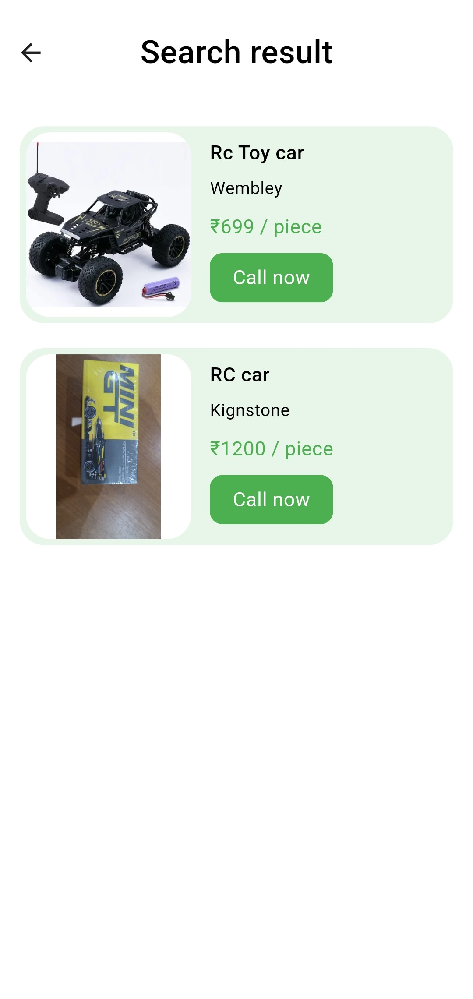

# SLE Buyer Flutter Application

**Seamless Linkage for Enterprise (SLE)** is my final year project, where I worked as the **backend developer**.

To further showcase my skills, I implemented my own backend using Flutter for the SLE Buyer Application, demonstrating the ability to integrate backend functionality within the app. The purpose of this project is to provide a platform for B2B businesses, enabling buyers to effortlessly browse products, connect with sellers, and manage their preferences.

### 🛠 Key Features

1. **Authentication**:

- Phone number authentication with OTP verification using Firebase.
- Secure login functionality.
- Logout functionality to ensure secure access control.

2. **Product Browsing**:

- View all listed products with detailed information.
- Search products by name or description.
- Discover similar products categorized for relevance.
- Browse products by category for easier navigation.

3. **Product Interaction**:

- Bookmark favorite products for later reference.
- Call sellers directly for inquiries or purchases.

4. **User Profile**:

- View and update profile details.
- Access a personalized bookmark screen for saved products.

5. **Additional Features**:

- Responsive and user-friendly design.
- Seamless transition between screens for a smooth user experience.

6. **SLE Seller and Backend**:  
   This app works in conjunction with the **SLE Seller Application** and the **SLE Backend**.
   - [SLE Seller](https://github.com/mananKoyawala/sle-seller)
   - [SLE Backend](https://github.com/Seamless-Linkage-for-Enterprises/sle-backend)

---

## 🔧 Technologies Used

- **Flutter** for front-end development.
- **Firebase** for authentication and backend integration.

---

## 🖥️ How to Run the App

1. Clone this repository:
   ```bash
   git clone https://github.com/yourusername/sle-buyer.git
   cd sle-buyer
   ```
2. Install the dependencies:
   ```bash
   flutter pub get
   ```
3. Run the application:
   ```bash
   flutter run
   ```

## 📂 Directory Structure

```bash
.
├── android               # Android-specific files
├── ios                   # iOS-specific files
├── assets                # Static assets like images and icons
├── lib                   # Main application code
│   ├── api               # Common HTTP functions (GET, POST, etc.)
│   ├── connection        # Connectivity-related utilities (e.g., connectivity_plus)
│   ├── helper            # Middleware between API and function calls
│   ├── models            # Data models
│   ├── packages          # Custom reusable components (e.g., text, text fields, buttons)
│   ├── providers         # State management logic (e.g., Riverpod providers)
│   ├── screens           # All application screens (e.g., Home, Profile, etc.)
│   ├── service           # App-level services like NavigatorKey
│   ├── utils             # Utility functions and reusable widgets
│   │   ├── widgets       # Folder for reusable widgets (e.g., NoInternet, loaders)
│   │   └── constants.dart # App-wide constants (e.g., colors, text styles)
├── output                # Contains the APK file for distribution
├── pubspec.yaml          # Dependencies and app configuration
└── README.md             # Project documentation

```

## 📱 SLE Seller Application

- The SLE Seller Application is the counterpart of this buyer app, designed specifically for sellers to manage their products (add, update, or delete). Check it out here:
  👉 [SLE Seller Repository](https://github.com/mananKoyawala/sle-seller)

## 💻 SLE Backend

- The SLE Backend handles the core functionality of the application, such as authentication, product management, and database operations. Explore it here:
  👉 [SLE Backend Repository](https://github.com/Seamless-Linkage-for-Enterprises/sle-backend)

## 🛠 Technical Details

The SLE Buyer Application leverages the following key technologies:

- Riverpod: Used for state management to ensure a reactive and efficient app architecture.
- HTTP: Used for backend integration to handle API requests and responses.
- connectivity_plus: Used to check network connectivity and provide a seamless offline/online experience.

## 📸 Screenshots





## 📂 APK Download

- To download and test the buyer app, you can use the APK file available in the output folder in the root directory:
  👉 [Download APK](output/sle_buyer.apk)

## 🧪 Test Account

You can use the following test account credentials to explore the app's functionality:

- Phone number: 94516 78524
- OTP: 473501

## 📜 [LICENSE](LICENSE)
